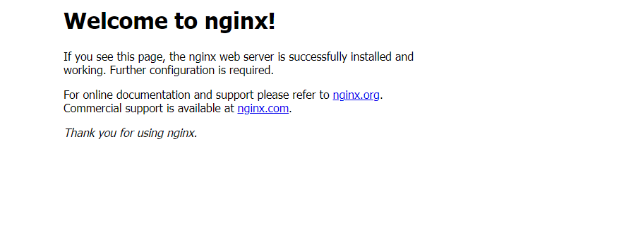
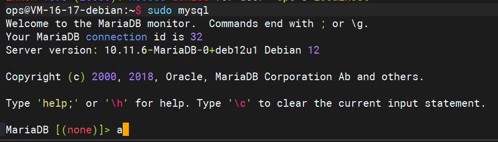
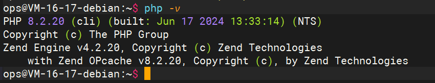
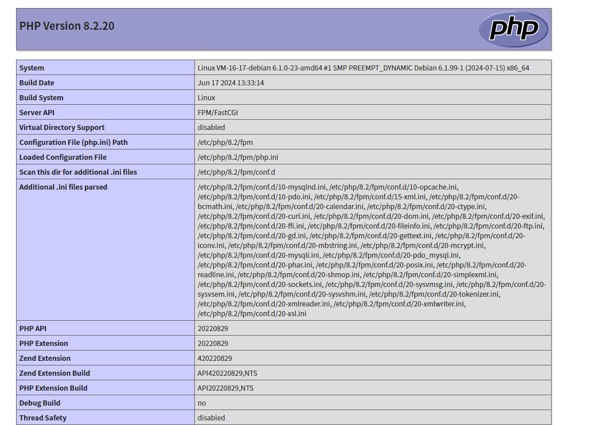

# 手动搭建 LNMP 环境

## 操作场景

LNMP 环境是指在 Linux 系统下，由 Nginx + MySQL/MariaDB + PHP 组成的网站服务器架构。本文档介绍如何在云服务器上手动搭建 LNMP 环境。


## 示例软件版本

本文搭建的 LNMP 环境软件组成版本及说明如下：

- Linux：Linux 操作系统，本文以 debian 12.6 为例。
- Nginx：Web 服务器，本文以  Nginx 1.22.1 为例。
- MariaDB：数据库，本文以 MariaDB 10.11.6 为例。
- PHP：脚本语言，本文以 PHP 8.2.20 为例。


## 操作步骤

### 步骤1：登录 Linux 实例

根据实际操作习惯，选择其他不同的登录方式：如使用ssh登录、通过vnc登录等。

### 步骤2：安装 Nginx

1、确认源文件正常，执行以下命令。

```shell
vim /etc/apt/sources.list
```

2、确认源文件正常,按 **i** 切换至编辑模式，写入以下内容,或使用确认的内部、外部源地址。

```shell
deb http://mirrors.tencentyun.com/debian bookworm main contrib non-free non-free-firmware
#deb-src http://mirrors.tencentyun.com/debian bookworm main contrib non-free non-free-firmware
deb http://mirrors.tencentyun.com/debian bookworm-updates main contrib non-free non-free-firmware
#deb-src http://mirrors.tencentyun.com/debian bookworm-updates main contrib non-free non-free-firmware
deb http://mirrors.tencentyun.com/debian-security/ bookworm-security main contrib non-free-firmware
#deb-src http://mirrors.tencentyun.com/debian-security/ bookworm-security main contrib non-free-firmware
```

3、按 **Esc**，输入 **:wq**，保存文件并返回。

4、执行以下命令，安装 nginx。

```shell
sudo apt update
sudo apt install nginx-full
```

5、执行以下命令，打开 `default.conf` 文件，并填写对应申请域名的地址。

```shell
sudo vim /etc/nginx/sites-enabled/default.conf


server {
        server_name localhost;

        listen 80;
#        listen [::]:80;   //ipv6监听 如有需要可放开
#        listen 443 ssl;   //https  ssl 443监听 如有需要可放开
#        listen [::]:443 ssl;
    
#        ssl_certificate /etc/nginx/cert/qiubite.site.crt;   //ssl证书位置
#        ssl_certificate_key /etc/nginx/cert/qiubite.site.key;  //ssl证书位置
    
#        proxy_http_version 1.1;       //长连接以及请求头传到后端
#        proxy_set_header Connection "";
#        proxy_set_header Host      $host;
#        proxy_set_header X-Real-IP $remote_addr;
#        proxy_set_header X-Forwarded-For $proxy_add_x_forwarded_for;
    
        error_page   500 502 503 504  /50x.html;
    
        root /usr/share/nginx/html;
    
        location / {
                index index.php index.html index.htm;
        }
        location = /50x.html {
                root   /usr/share/nginx/html;
        }
        location ~ .php$ {
                fastcgi_pass unix:/var/run/php/php-fpm.sock;
                fastcgi_index  index.php;
                fastcgi_param  SCRIPT_FILENAME  $document_root$fastcgi_script_name;
                include        fastcgi_params;
        }

} 
```

6、按 **Esc**，输入 **:wq**，保存文件并返回。

7、执行以下命令检查语法并启动 Nginx，设置 Nginx 为开机自启动。

```shell
sudo nginx -t
sudo systemctl start nginx
sudo systemctl enable nginx 
```

8、在本地浏览器中访问nginx中配置的域名或公网IP，查看 Nginx 服务是否正常运行

```shell
http://云服务器实例的公网 IP 或配置的域名
```

显示如下，则说明 Nginx 安装配置成功。



### 步骤3：安装数据库

1、执行以下命令，查看系统中是否已安装 MariaDB。 如未安装可继续安装数据库

```bash
sudo apt search mariadb | grep mariadb   //查看系统中是否已安装 MariaDB

sudo apt install mariadb-server mariadb-client   //安装数据库
```

2、执行以下命令，启动 MariaDB 服务，设置 MariaDB 为开机自启动。

```shell
sudo systemctl start mariadb
sudo systemctl enable mariadb
```

3、执行以下命令，验证 MariaDB 是否安装成功。

```shell
sudo mysql
```

显示结果如下，则成功安装。



4、执行以下命令，退出 MariaDB。

```shell
MariaDB [(none)]> quit
```

### 步骤4：安装配置 PHP

1、执行以下命令，安装 PHP 8.2 所需要的包。

```shell
sudo apt search php-fpm   \\查看软件源中php的版本

sudo apt install php libapache2-mod-php php-mysql php-cli php-curl php-xml php-gd php-mbstring php-fpm php-json php-pear php-bcmath php-mcrypt
```

2、执行以下命令，验证 PHP 是否安装成功。

```shell
php -v
```

显示结果如下，则成功安装。



## 验证环境配置

当您完成环境配置后，可以通过以下验证 LNMP 环境是否搭建成功。

1. 执行以下命令，创建测试文件。

```shell
echo "<?php phpinfo(); ?>" | sudo tee /usr/share/nginx/html/index.php
```


2、在本地浏览器中访问如下地址，查看环境配置是否成功。

```plaintext
http://云服务器实例的公网 IP/index.php  或 http://nginx配置的域名/index.php
```

显示结果如下，则说明环境配置成功。




3、
