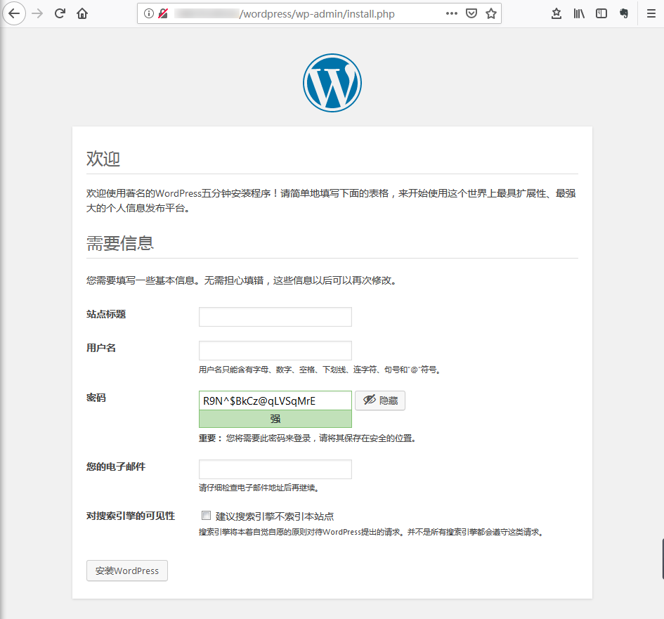

# 手动搭建 WordPress 个人站点(Linux)

## 操作场景

WordPress 是一款使用 PHP 语言开发的博客平台，您可使用通过 WordPress 搭建属于个人的博客平台或个人网站。本文以 debian 12.6 操作系统服务器为例，手动搭建 WordPress 个人站点。

## 示例软件版本

本文搭建的 WordPress 个人站点组成版本及说明如下：

- Linux：Linux 操作系统，本文以 debian 12.6 为例。
- Nginx：Web 服务器，本文以  Nginx 1.22.1 为例。
- MariaDB：数据库，本文以 MariaDB 10.11.6 为例。
- PHP：脚本语言，本文以 PHP 8.2.20 为例。
- WordPress：博客平台，本文以 WordPress 6.6.1 为例。

## 操作步骤

### 步骤1：登录 Linux 实例

根据实际操作习惯，选择其他不同的登录方式：如使用ssh登录、通过vnc登录等。

### 步骤2：手动搭建 LNMP 环境

LNMP 是 Linux、Nginx、MariaDB 和 PHP 的缩写，这个组合是最常见的 Web 服务器的运行环境之一。在登录服务器实例之后，您可以参见 [手动搭建 LNMP 环境](/wordpress/手动搭建%20LNMP%20环境)完成基本环境搭建。

### 步骤3：配置数据库

1、执行以下命令，进入 MariaDB。

```shell
sudo mysql
```

2、执行以下命令，创建 MariaDB 数据库。例如 “wordpress”。

```shell
CREATE DATABASE wordpress;
```

3、执行以下命令，创建一个新用户。例如 “user”，登录密码为 `123456`。

```shell
create user 'user'@'localhost' IDENTIFIED BY '123456';
```

4、执行以下命令，赋予用户对 “wordpress” 数据库的全部权限。

```shell
GRANT ALL PRIVILEGES ON wordpress.* TO 'user'@'localhost';
```

5、执行以下命令，设置 root 账户密码。

```shell
ALTER USER root@localhost IDENTIFIED VIA mysql_native_password USING PASSWORD('输入您的密码');
```

6、执行以下命令，使所有配置生效。

```shell
FLUSH PRIVILEGES;
```

7、执行以下命令，退出 MariaDB。

```shell
\q
```

### 步骤4：安装和配置 WordPress

#### 下载 WordPress

1、执行以下命令，删除网站根目录下用于测试 PHP-Nginx 配置的`index.php`文件。

```shell
rm -rf /usr/share/nginx/html/index.php
```

2、依次执行以下命令，进入`/usr/share/nginx/html/`目录，并下载与解压 WordPress。

```shell
cd /usr/share/nginx/html

wget https://cn.wordpress.org/wordpress-6.6.1-zh_CN.tar.gz

tar zxvf wordpress-6.6.1-zh_CN.tar.gz
```


WordPress可以放到自定义的目录，修改时需要同步修改nginx配置文件中root 描述的目录。


#### 修改 WordPress 配置文件

1、依次执行以下命令，进入 WordPress 安装目录，将`wp-config-sample.php`文件复制到`wp-config.php`文件中，并将原先的示例配置文件保留作为备份。

```shellsession
cd /usr/share/nginx/html/wordpress
cp wp-config-sample.php wp-config.php
```

2、执行以下命令，打开并编辑新创建的配置文件。

```shell
vim wp-config.php
```

3、按 **i** 切换至编辑模式，找到文件中 MySQL 的部分，并将相关配置信息修改为配置 WordPress 数据库 中的内容。

```shell
 // ** Database settings - You can get this info from your web host ** //
/** The name of the database for WordPress */
define( 'DB_NAME', 'wordpress' );

/** Database username */
define( 'DB_USER', 'user' );

/** Database password */
define( 'DB_PASSWORD', '123456' );

/** Database hostname */
define( 'DB_HOST', 'localhost' );

```

4、修改完成后，按 **Esc**，输入 **:wq**，保存文件返回。


### 步骤5：验证 WordPress 安装

1、在浏览器地址栏输入`http://域名或公网 IP/wordpress 文件夹`，例如：

```shell
http://192.xxx.xxx.xx/wordpress  
或
http://xxx.com/wordpress
```

转至 WordPress 安装页，开始配置 WordPress。



2、根据 WordPress 安装向导提示输入以下安装信息，单击**安装 WordPress**，完成安装。

| 所需信息     | 说明                                                         |
| ------------ | ------------------------------------------------------------ |
| 站点标题     | WordPress 网站名称。                                         |
| 用户名       | WordPress 管理员名称。出于安全考虑，建议设置一个不同于 admin 的名称。因为与默认用户名称 admin 相比，该名称更难破解。 |
| 密码         | 可以使用默认的密码或者自定义密码。请勿重复使用现有密码，并确保将密码保存在安全的位置。 |
| 您的电子邮件 | 用于接收通知的电子邮件地址。                                 |


3、输入在安装WordPress时设置的**用户名**和**密码**，然后单击**登录**

成功进入您个人的WordPress网站。